  
  
  
  

<a href="README.md">🇧🇷 Português</a> &nbsp;·&nbsp; 🇬🇧 English

  

 

## About

I'm a **Full Stack Software Engineer**. I design systems and build them from the first commit to deploy, and what drives me is delivering the end result, however hard the path gets. Today my focus is **multi-tenant SaaS and ERP systems**, with TypeScript, PostgreSQL and infrastructure ready to grow.

I own the whole system: data modeling, architecture, API, interface, infrastructure and delivery. Architecture and security decisions come before the code, and that is where I lead the team, with clear standards and code review.

The market moves fast and I adapt along with it. AI is part of my workflow as an engineering tool: it speeds up execution, but the design of the solution, the trade-offs and the accountability for what ships to production remain mine.

 

## Career

| Period | Where | Role |
| :-- | :-- | :-- |
| **Jun 2026 — now** | V-ONE | Jr. Full Stack Software Engineer |
| **Jun 2025 — now** | Eximia Tech | Jr. Full Stack Software Engineer |
| **2024 — 2025** | Freelance | Independent Full Stack developer |
| **2025 — 2027** | IFNMG | B.Sc. in Systems Analysis and Development |

> 🧭 Despite being a junior, I was appointed by my manager as the **technical owner of the company's projects**, guiding the team on architecture decisions and best practices.

 

## Featured projects

<table>
  <tr>
    <td width="33%" valign="top">
      
      <h3>Agendai</h3>
      <b>Multi-tenant SaaS · 2025 · Tech Lead</b>
      
Scheduling platform with recurring Stripe billing, real-time dashboards and total per-tenant data isolation (RLS). In production, with self-service onboarding.

      
<code>Next.js</code> <code>Supabase</code> <code>PostgreSQL</code> <code>Stripe</code> <code>DDD</code>

      <a href="https://agendai.tec.br/">See the product →</a>
    </td>
    <td width="33%" valign="top">
      
      <h3>ContaUp 🥇</h3>
      <b>Financial SaaS · 2026 · Tech Lead</b>
      
1st place at IFNMG's Shark TADS panel as the most well-structured project. I led 11 people with Clean Architecture + DDD, anti-DDoS Nginx, Docker and CI/CD.

      
<code>Next.js</code> <code>Node.js</code> <code>Supabase</code> <code>Docker</code> <code>Nginx</code>

      <a href="https://contaup-techbalance.vercel.app/">Demo</a> · <a href="https://github.com/gui-ccr/contap-backend">Backend</a> · <a href="https://github.com/gui-ccr/contap-frontend">Frontend</a>
    </td>
    <td width="33%" valign="top">
      
      <h3>Condo ERP</h3>
      <b>ERP system · 2025 · Architect</b>
      
Complete management for condominium administrators: finance, billing, common areas and a resident portal. 24+ screens, multi-level RBAC in PostgreSQL and per-tenant RLS. In production.

      
<code>React</code> <code>TypeScript</code> <code>PostgreSQL</code> <code>RBAC</code> <code>RLS</code>

      Private (NDA) — architecture details on request.
    </td>
  </tr>
</table>

Also: [**ClinicaFlow AI**](https://clinicaflow.ia.br/) (high-conversion landing with GSAP + Stripe Checkout) and [**Eximia Tech**](https://www.eximiatech.com.br/) (business site focused on performance and SEO). Every case study, with challenge, solution and outcome, lives in the [portfolio](https://www.gui-ccr.com.br).

 

## Stack

  
    
  

 

## GitHub activity

  
  
    
  <picture>
    <source media="(prefers-color-scheme: light)" srcset="https://raw.githubusercontent.com/gui-ccr/gui-ccr/output/pacman-contribution-graph.svg">
    
  </picture>

 

<b>Beyond the code</b>

 

- 🎓 **Education:** B.Sc. in Systems Analysis and Development, IFNMG (expected: 2027).
- 🌎 **Languages:** Portuguese (native) · English B2+ · Spanish A2.
- 🎸 **Music** all the time, with guitar learned on my own, the same way I learned to code.
- 🏍️ **Riding my motorcycle** is my mental Ctrl+Alt+Del after a full day of screen time.
- 🎮 A round of Valorant and hanging out with my dog, Ikky.

  Let's talk? <a href="mailto:contato@gui-ccr.com.br">contato@gui-ccr.com.br</a> &nbsp;·&nbsp; <a href="https://www.gui-ccr.com.br">gui-ccr.com.br</a>

