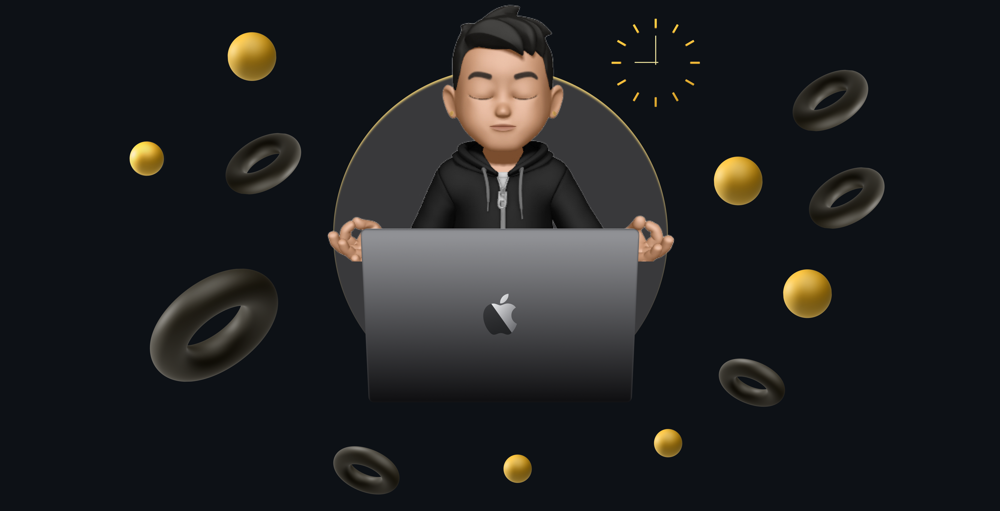

<h1 align="left">Guilherme Rodrigues</h1>

  <strong>Engenheiro de Software Full Stack</strong>

  
  
  

 

🇧🇷 <strong>Português</strong> (Clique para fechar)

 

### 👨‍💻 Sobre Mim

Meu foco é construir **ecossistemas de software completos**. Acredito que um desenvolvedor de alto nível deve dominar a engenharia da aplicação de ponta a ponta, garantindo segurança no Backend e experiência fluida no Front-End.

Minha abordagem é pautada por **Arquitetura de Software**, **Performance** e **Lógica de Negócio**. Utilizo minha base em Análise de Sistemas para modelar bancos de dados relacionais e criar interfaces complexas e escaláveis.

* 🧠 **Foco Técnico:** Clean Architecture, SOLID, DDD (Padrões Táticos) e Segurança de Dados.
* 🌱 **Estudando:** Engenharia de Software avançada, focado em padrões de arquitetura e sistemas distribuídos.
* 💼 **Objetivo:** Oportunidade como Desenvolvedor Fullstack ou Engenheiro de Software.

---

### 🛠 Tech Stack

**Frontend & Interface**
 

**Backend, Dados & Segurança**
 

**Engenharia & Ferramentas**
 

---

### 🚀 Experiência Real & Projetos

**🏢 Sistema Integrado de Gestão de Condomínios (ERP SaaS)**
*Desenvolvimento integral (Fullstack) de uma plataforma com mais de 24 interfaces.*
- **Segurança (RBAC + RLS):** Implementei controle de acesso granular para diferentes perfis e isolamento total de dados no banco.
- **Engenharia:** Módulos financeiros complexos e gestão administrativa focada em escalabilidade.

**📅 Agendai (Ecossistema Multi-App)**
*Plataforma completa composta por 3 aplicações: Portal do Cliente, ERP da Empresa e Landing Page.*
- **Features Avançadas:** Sistema **White-Label**, **Geolocalização** (Google Maps) e integrações de pagamento via Stripe.
- **Arquitetura:** Next.js (App Router) com foco em performance e SEO.

---

### 📊 Github Stats

  
  

 

🇬🇧 <strong>English</strong> (Click to expand)

 

### 👨‍💻 About Me

My focus is on building **complete software ecosystems**. I believe a high-level developer must master end-to-end engineering, ensuring security on the Backend and a fluid experience on the Front-End.

* 🧠 **Technical Focus:** Clean Architecture, SOLID, DDD (Tactical Patterns), and Data Security.
* 🌱 **Learning:** Advanced Software Engineering, focused on architectural patterns and distributed systems.
* 💼 **Goal:** Opportunity as a Fullstack Developer or Software Engineer.

---

### 🛠 Tech Stack

**Frontend & Interface**
 

**Backend, Data & Security**
 

**Engineering & Tools**
 

---

### 🚀 Real-World Experience & Projects

**🏢 Condo Management System (ERP SaaS)**
- **Security (RBAC + RLS):** Implemented granular access control and total data isolation.
- **Engineering:** Complex financial modules and administrative management focused on scalability.

**📅 Agendai (Multi-App Ecosystem)**
- **Advanced Features:** **White-Label** system, **Geolocation**, and Stripe payment integrations.
- **Architecture:** Next.js (App Router) focused on performance and SEO.

---

### 📊 Github Stats

  
  

