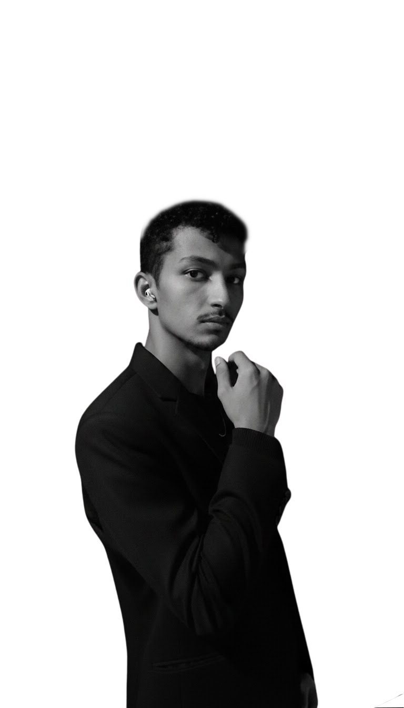
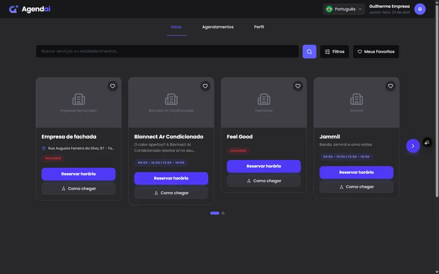
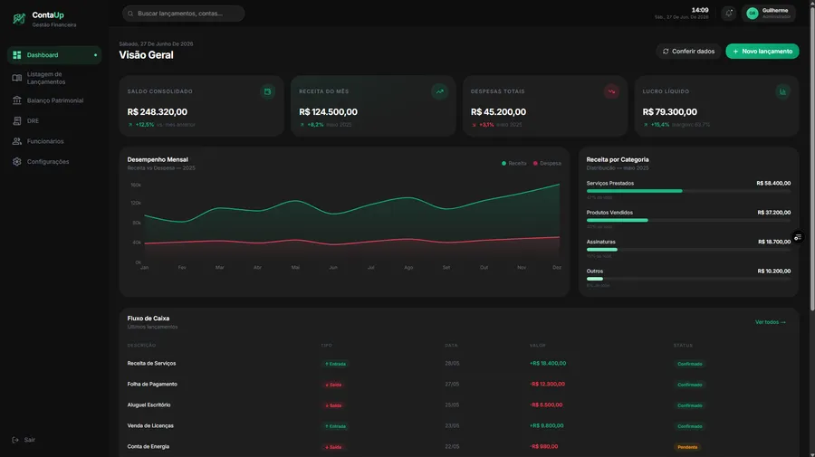
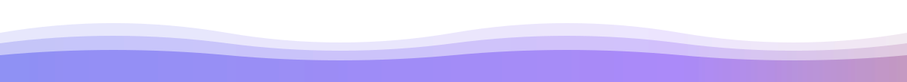

  
  <a href="https://www.linkedin.com/in/gui-ccr-"></a>
  <a href="mailto:contato@gui-ccr.com.br"></a>
  <a href="https://www.gui-ccr.com.br/curriculo-pt.pdf"></a>

🇧🇷 Português &nbsp;·&nbsp; <a href="README.en.md">🇬🇧 English</a>

  



 

## Sobre



Sou **Engenheiro de Software Full Stack** e trabalho mais perto da **arquitetura** do que do "só fazer funcionar". Projeto, desenvolvo e coloco em produção **SaaS e ERPs multi-tenant**, do primeiro commit ao deploy, com TypeScript, PostgreSQL e uma infraestrutura pensada pra crescer sem virar dívida técnica.

O que eu cuido antes da tela existir:

- 🔐 **Isolamento de dados por tenant**: RLS e RBAC direto no PostgreSQL.
- 🏛️ **Arquitetura em camadas**: Clean Architecture, DDD e SOLID no front e no back.
- 🚢 **Infra e entrega**: Docker, Nginx (proxy reverso + rate-limit), CI/CD com GitHub Actions.
- 🤝 **Liderança técnica**: code review, padrões de código e mentoria de quem está começando.

Uso IA como parceira de trabalho, mas as decisões de arquitetura e segurança continuam sendo minhas.

 

## Trajetória

| Período | Onde | Papel |
| :-- | :-- | :-- |
| **Jun 2026 — hoje** | V-ONE | Eng. de Software Full Stack Jr. |
| **Jun 2025 — hoje** | Eximia Tech | Eng. de Software Full Stack Jr. |
| **2024 — 2025** | Freelance | Full Stack autônomo |
| **2025 — 2027** | IFNMG | Tecnólogo em Análise e Desenvolvimento de Sistemas |

> 🧭 Mesmo como júnior, fui designado pelo meu gestor como **responsável técnico pelos projetos da empresa**, orientando o time em decisões de arquitetura e boas práticas.

 

## Projetos em destaque

<table>
  <tr>
    <td width="33%" valign="top">
      <a href="https://agendai.tec.br/"></a>
      <h3>Agendai</h3>
      <b>SaaS multi-tenant · 2025 · Tech Lead</b>
      
Plataforma de agendamento com assinaturas recorrentes via Stripe, dashboards em tempo real e isolamento total de dados por tenant (RLS). Em produção, com onboarding self-service.

      
<code>Next.js</code> <code>Supabase</code> <code>PostgreSQL</code> <code>Stripe</code> <code>DDD</code>

      <a href="https://agendai.tec.br/">Ver o produto →</a>
    </td>
    <td width="33%" valign="top">
      <a href="https://contaup-techbalance.vercel.app/"></a>
      <h3>ContaUp 🥇</h3>
      <b>SaaS financeiro · 2026 · Tech Lead</b>
      
1º lugar na banca Shark TADS do IFNMG como o projeto mais bem estruturado. Liderei 11 pessoas com Clean Architecture + DDD, Nginx anti-DDoS, Docker e CI/CD.

      
<code>Next.js</code> <code>Node.js</code> <code>Supabase</code> <code>Docker</code> <code>Nginx</code>

      <a href="https://contaup-techbalance.vercel.app/">Demo</a> · <a href="https://github.com/gui-ccr/contap-backend">Backend</a> · <a href="https://github.com/gui-ccr/contap-frontend">Frontend</a>
    </td>
    <td width="33%" valign="top">
      
      <h3>ERP Condomínios</h3>
      <b>Sistema ERP · 2025 · Arquiteto</b>
      
Gestão completa para administradoras: financeiro, boletos, áreas comuns e portal do morador. 24+ telas, RBAC multi-nível no PostgreSQL e RLS por tenant. Em produção.

      
<code>React</code> <code>TypeScript</code> <code>PostgreSQL</code> <code>RBAC</code> <code>RLS</code>

      Privado (NDA) — detalhes de arquitetura sob demanda.
    </td>
  </tr>
</table>

Também: [**ClinicaFlow AI**](https://clinicaflow.ia.br/) (landing de alta conversão com GSAP + Stripe Checkout) e [**Eximia Tech**](https://www.eximiatech.com.br/) (site institucional focado em performance e SEO). Todos os cases, com desafio, solução e resultado, estão no [portfólio](https://www.gui-ccr.com.br).

 

## Stack

  
    
  

 

## Atividade no GitHub

  
  
    
  

 

<b>Fora do código</b>

 

- 🎓 **Formação:** Tecnólogo em Análise e Desenvolvimento de Sistemas, IFNMG (previsão: 2027).
- 🌎 **Idiomas:** Português nativo · Inglês B2+ · Espanhol A2.
- 🎸 **Música** o tempo todo, com violão e guitarra aprendidos sozinho, do mesmo jeito que aprendi a programar.
- 🏍️ **Moto** é o meu Ctrl+Alt+Del depois de um dia inteiro de tela.
- 🎮 Uma partida de Valorant e a companhia do meu cachorro, o Ikky.



  Vamos conversar? <a href="mailto:contato@gui-ccr.com.br">contato@gui-ccr.com.br</a> &nbsp;·&nbsp; <a href="https://www.gui-ccr.com.br">gui-ccr.com.br</a>

